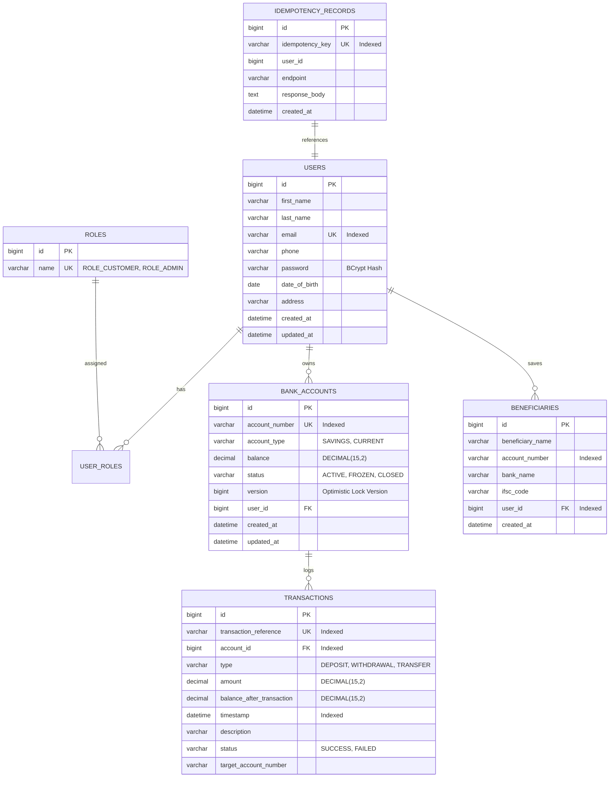

# BankFlow — Banking & Transaction Management System

[](https://adoptium.net)
[](https://spring.io/projects/spring-boot)
[](https://spring.io/projects/spring-security)
[](https://www.mysql.com)
[](https://react.dev)
[-success.svg)](https://github.com)

**BankFlow** is an enterprise-grade, production-style banking and transaction management platform engineered to demonstrate real-world financial architectures, ACID database transactions, concurrency control, idempotency, security best practices, and automated testing.

Designed specifically for **Java / Spring Boot developer interviews and resume presentation**, BankFlow avoids simplistic CRUD patterns in favor of robust enterprise mechanisms including:
- **Pessimistic Row-Level Locking (`PESSIMISTIC_WRITE`)** for concurrency-safe balances.
- **Deadlock-Free Canonical Lock Ordering** (`min(accA, accB)` followed by `max(accA, accB)`).
- **Idempotent HTTP API Processing** via `Idempotency-Key` headers to protect against network retry double-debits.
- **Stateless JWT Authentication & RBAC** with Spring Security 6.
- **Arbitrary-Precision Decimal Math** using `BigDecimal` (zero floating-point drift).
- **Automated OpenPDF Account Statement Exports**.
- **Interactive OpenAPI 3 / Swagger Documentation**.
- **Full-Stack Experience** with a modern **React 18 + Vite + Tailwind CSS** dashboard.

---

## 1. Architectural Blueprint

BankFlow strictly implements a **Layered Monolithic Architecture** with clear Separation of Concerns:

```mermaid
graph TD
    Client[React Frontend / Swagger UI / Mobile API] -->|HTTP / JSON + Bearer JWT| Filter[JwtAuthenticationFilter]
    Filter -->|Validated Principal| Controller[Controller Layer<br/>@RestController]
    Controller -->|Request DTOs| Service[Service Layer<br/>@Service + @Transactional]
    Service -->|Entities & JPQL| Repo[Repository Layer<br/>@Repository + Spring Data JPA]
    Repo -->|JDBC / HikariCP| DB[(MySQL 8 Database)]
    Service -.->|Map DTOs| Mapper[Mapper Layer<br/>@Component]
    Controller -.->|Catch Domain Exceptions| Advice[GlobalExceptionHandler<br/>@RestControllerAdvice]
```

### Layer Responsibilities

| Package | Role & Boundaries | Key Annotations / Tech |
| :--- | :--- | :--- |
| `com.bankflow.controller` | HTTP routing, request deserialization, status codes, OpenAPI metadata. Strictly zero business logic. | `@RestController`, `@RequestMapping`, `@Valid` |
| `com.bankflow.service` | Pure business rules, transaction boundaries, concurrency locks, audit triggers. | `@Service`, `@Transactional`, `LockModeType.PESSIMISTIC_WRITE` |
| `com.bankflow.repository` | Relational data access, derived queries, pageable queries, row-level locks. | `@Repository`, `JpaRepository`, `@Lock`, `@Query` |
| `com.bankflow.entity` | JPA domain models mapped to relational tables. Uses `BigDecimal` and JPA auditing. | `@Entity`, `@Table`, `@Version`, `@CreatedDate` |
| `com.bankflow.dto` | API request and response contracts. Prevents over-posting and entity leakage. | Jakarta Validation (`@NotNull`, `@Size`, `@Positive`) |
| `com.bankflow.mapper` | Explicit Java object mapping between Entities and DTOs. | `@Component` |
| `com.bankflow.security` | Stateless JWT filter chain, BCrypt password encoder, user principal loading. | `@EnableWebSecurity`, `@EnableMethodSecurity`, JJWT |
| `com.bankflow.exception` | Centralized domain exceptions mapped to standardized RFC error JSON responses. | `@RestControllerAdvice`, `@ExceptionHandler` |
| `com.bankflow.config` | Spring Bean configurations: Swagger/OpenAPI, CORS, seed data initialization. | `@Configuration`, `@Bean`, `CommandLineRunner` |
| `com.bankflow.util` | Stateless helpers for account numbers and transaction reference generation. | `SecureRandom`, `DateTimeFormatter` |

---

## 2. Database Design & Entity Relationships

The schema guarantees financial integrity through foreign key constraints, unique constraints, and strategic indexes:



---

## 3. Core Enterprise Engineering Features

### A. Concurrency Control & Deadlock Prevention in Transfers
When two accounts transfer money between each other concurrently (e.g., Thread 1 transfers $A \rightarrow B$, while Thread 2 transfers $B \rightarrow A$):
- **Naïve Locking** creates a circular wait condition: Thread 1 acquires lock on $A$ and waits for $B$; Thread 2 acquires lock on $B$ and waits for $A$ $\rightarrow$ **Deadlock!**
- **BankFlow Solution (Canonical Ordering)**:
  ```java
  // Always lock accounts in order of lower numerical ID first!
  Long firstLockId = Math.min(fromAccountId, toAccountId);
  Long secondLockId = Math.max(fromAccountId, toAccountId);

  BankAccount firstAccount = bankAccountRepository.findByIdWithLock(firstLockId);
  BankAccount secondAccount = bankAccountRepository.findByIdWithLock(secondLockId);
  ```
  Both threads attempt to lock the smaller account ID first. Thread 2 waits predictably until Thread 1 commits. Deadlock condition is **mathematically eliminated**.

### B. Idempotency Support (`Idempotency-Key`)
When a client sends a payment request over a mobile network and the network drops before receiving the response:
1. Client generates a UUID: `Idempotency-Key: c9b2f671-5582-4f62-8178-57778b0f7194`.
2. BankFlow checks `idempotency_records`.
3. If new: Process the transfer, store the response JSON, and commit.
4. If retry: Retrieve the cached response from the database and return it immediately **without re-executing any account debit**.

### C. Floating Point vs `BigDecimal`
Float and Double follow IEEE 754 floating-point standards, where fractional values like `0.1 + 0.2` equal `0.30000000000000004`. In banking, this creates monetary reconciliation errors. BankFlow strictly models all financial figures using `java.math.BigDecimal` (`precision = 15, scale = 2`) with `RoundingMode.HALF_EVEN`.

---

## 4. Technology Stack Matrix

| Layer | Technologies |
| :--- | :--- |
| **Language & Runtime** | Java 17 LTS (Eclipse Temurin) |
| **Framework** | Spring Boot 3.3.4 |
| **Security** | Spring Security 6, JJWT (v0.12.6), BCrypt |
| **ORM & Database** | Spring Data JPA, Hibernate 6.5, HikariCP, MySQL 8, H2 (test profile) |
| **Validation** | Jakarta Bean Validation API |
| **Documentation** | SpringDoc OpenAPI 3 / Swagger UI (v2.6.0) |
| **PDF Reporting** | OpenPDF (v1.3.40) |
| **Testing** | JUnit 5, Mockito, MockMvc, AssertJ, Spring Security Test |
| **Containerization** | Docker, Multi-Stage Dockerfile, Docker Compose |
| **Frontend** | React 18, Vite, Tailwind CSS, Axios, React Router v6, Lucide Icons |

---

## 5. Quick Start & Local Setup

### Prerequisites
- **JDK 17** (Eclipse Temurin or OpenJDK 17)
- **Node.js** (v18+)
- **MySQL 8** (or Docker)

### Option 1: Run with Docker Compose (Fastest & Fully Automated)
```bash
# Clone and enter directory
cd springpeo

# Start MySQL 8 and BankFlow Backend together
docker-compose up --build
```
- Backend will be live at `http://localhost:8080`.
- MySQL 8 will be running at port `3306`.

---

### Option 2: Run Locally (Bare-Metal / IDE)

#### 1. Backend Setup:
```bash
# Run backend directly using the bundled Maven Wrapper
# (Defaults to MySQL in application-dev.yml or fallback to in-memory H2 via profile)
.\mvnw.cmd spring-boot:run

# Or run with the in-memory H2 profile (zero MySQL setup required!):
.\mvnw.cmd spring-boot:run -Dspring-boot.run.profiles=h2
```

#### 2. Frontend Setup:
```bash
cd frontend

# Install dependencies
npm install

# Start Vite dev server
npm run dev
```
Open your browser at **`http://localhost:5173`**.

---

## 6. Seed Accounts & Test Credentials

On initial startup, BankFlow automatically provisions pre-configured test users and accounts:

| Role | Email | Password | Initial Balance | Default Account No. |
| :--- | :--- | :--- | :--- | :--- |
| **ADMIN** | `admin@bankflow.com` | `Admin@123` | N/A | N/A |
| **CUSTOMER** | `john.doe@bankflow.com` | `Customer@123` | **$10,000.00** | Auto-generated (`100xxxxxxxxx`) |
| **CUSTOMER** | `sarah.smith@bankflow.com` | `Customer@123` | **$5,000.00** | Auto-generated (`100xxxxxxxxx`) |

> [!TIP]
> The login screen at `http://localhost:5173/login` includes **1-Click Demo Fill Buttons** to quickly test Customer and Admin workflows.

---

## 7. Interactive API Documentation (Swagger)

Once the backend is running, access the interactive OpenAPI documentation:
- **Swagger UI**: [http://localhost:8080/swagger-ui.html](http://localhost:8080/swagger-ui.html)
- **OpenAPI JSON Docs**: [http://localhost:8080/v3/api-docs](http://localhost:8080/v3/api-docs)

To test secured endpoints inside Swagger UI:
1. Execute `POST /api/auth/login` with your credentials.
2. Copy the returned `token`.
3. Click the **Authorize** button at the top right of Swagger UI and paste: `<token>`.

---

## 8. Automated Test Suite

BankFlow includes **17 automated unit and integration tests** verifying all business rules, edge cases, and authorization boundaries:

```bash
# Run all unit and integration tests
.\mvnw.cmd test
```

### Key Test Scenarios Covered:
1. `transferMoney_Success`: Atomic debit from sender, credit to recipient, and ledger recording.
2. `transferMoney_SameAccount_ThrowsException`: Rejection of self-transfers.
3. `transferMoney_InsufficientBalance_ThrowsException`: Validation when account balance is lower than transfer amount.
4. `transferMoney_SenderFrozen_ThrowsException`: Rejection when account status is `FROZEN`.
5. `transferMoney_RecipientFrozen_ThrowsException`: Rejection of incoming transfers to frozen accounts.
6. `transferMoney_UnauthorizedSender_ThrowsException`: User cannot debit an account belonging to someone else.
7. `transferMoney_Idempotency_ReturnsCachedResponse`: Verifies that duplicate transfer requests with the same `Idempotency-Key` return the cached response without debiting again.
8. `deposit_Success` & `withdraw_Success`: Direct account mutations with audit balance verification.
9. `withdraw_InsufficientBalance_ThrowsException`: Overdraft protection.
10. `testTransferMoney_Unauthenticated_Rejected`: Spring Security 401 Unauthorized verification.

---

## 9. Interview Mastery Guide (High-Yield Questions)

### Q1: How does Spring's `@Transactional` work under the hood?
**Answer**: Spring uses **AOP (Aspect-Oriented Programming) dynamic proxies**. When a method annotated with `@Transactional` is invoked from outside the class:
1. The proxy intercepts the call and obtains a connection from `DataSource` (HikariCP).
2. It turns off auto-commit (`connection.setAutoCommit(false)`).
3. The business logic executes.
4. If the method completes normally, the proxy issues `connection.commit()`.
5. If an unchecked exception (`RuntimeException` or `Error`) is thrown, the proxy issues `connection.rollback()`. In BankFlow, we specify `@Transactional(rollbackFor = Exception.class)` so that checked exceptions also trigger rollback.

### Q2: What is the difference between Optimistic Locking and Pessimistic Locking?
**Answer**:
- **Optimistic Locking (`@Version`)**: Assumes conflicts are rare. Hibernate checks a version number upon updating (`WHERE id = ? AND version = ?`). If another transaction updated the row first, the version mismatch throws `OptimisticLockException`. Good for high-read, low-contention scenarios.
- **Pessimistic Locking (`PESSIMISTIC_WRITE`)**: Assumes conflicts are likely. Translates to `SELECT ... FOR UPDATE` at the database engine level. It physically locks the database rows until the transaction finishes. We use this for bank transfers to ensure zero race conditions when concurrent debits take place.

### Q3: Why is Constructor Injection preferred over `@Autowired` on fields?
**Answer**:
1. **Immutability**: Dependencies can be declared `final`, ensuring thread-safety and preventing re-assignment after creation.
2. **Prevents `NullPointerException`**: The object cannot be constructed in an invalid, half-initialized state.
3. **Ease of Unit Testing**: In JUnit tests, dependencies can be passed directly via the constructor without needing Mockito reflection or Spring Test Context.

### Q4: What are the differences between JPA `FetchType.LAZY` and `FetchType.EAGER`?
**Answer**:
- `FetchType.EAGER`: Fetches the associated entity/collection immediately using SQL `JOIN`. Used in BankFlow for `User.roles` because roles are always needed for Spring Security authentication.
- `FetchType.LAZY`: Fetches associated records only when getter methods are called. Used for `User.accounts` and `BankAccount.transactions` to prevent loading thousands of transaction rows into memory when only inspecting the user's name.

### Q5: What is the N+1 Query Problem in Hibernate and how is it mitigated?
**Answer**: When fetching $N$ parent entities, Hibernate issues 1 query to get all parents, and then $N$ separate queries to fetch each parent's children. It is resolved using `JOIN FETCH` in JPQL or Entity Graphs (`@EntityGraph`).

### Q6: Why do we use JWT instead of standard HTTP Sessions in a banking API?
**Answer**:
1. **Stateless Scalability**: The server holds no session state in memory. If we run 5 instances of BankFlow behind an AWS Application Load Balancer, any instance can validate the token without sticky sessions or distributed Redis session stores.
2. **CORS & Cross-Platform Support**: Works seamlessly across React web apps, iOS/Android mobile apps, and microservices.

### Q7: What is Idempotency and why is it mandatory for payment gateways and banking APIs?
**Answer**: An operation is idempotent if making $N$ identical requests produces the exact same server state as making 1 request. In money transfers, if a mobile network drops during request transit, the mobile app retries the HTTP call. Without an `Idempotency-Key` mechanism, the transfer would execute twice, stealing money from the customer.

### Q8: How did you prevent deadlocks during concurrent inter-account transfers?
**Answer**: By enforcing **Canonical Resource Ordering**. Deadlocks occur due to cyclical wait conditions ($A \rightarrow B$ while $B \rightarrow A$). By always ordering the pessimistic lock acquisition by the account ID (`min(idA, idB)` followed by `max(idA, idB)`), every thread acquires locks in the exact same sequence, making cyclical deadlock impossible.

### Q9: What is `@RestControllerAdvice` and how does it improve API architecture?
**Answer**: It acts as an interceptor for exceptions thrown across all `@RestController` classes. Instead of wrapping every controller method in messy `try-catch` blocks, exceptions are caught centrally and transformed into uniform, RFC-compliant JSON responses with standard status codes (400, 401, 403, 404, 409, 500).

### Q10: Why should you never use `double` or `float` for monetary values in Java?
**Answer**: Binary floating-point types (`float`, `double`) use base-2 scientific notation (IEEE 754) and cannot accurately represent base-10 fractions (like 0.10). Repeated arithmetic causes round-off error drift. `java.math.BigDecimal` provides arbitrary-precision signed decimal representations where every cent is accounted for exactly.

---

## 10. 2-Minute Interview Elevator Pitch

> *"For my major capstone project, I designed and built **BankFlow**, a production-style banking and transaction management system using **Java 17, Spring Boot 3, Spring Security 6 with JWT, and MySQL 8**, paired with a **React and Tailwind CSS** frontend.*
>
> *Rather than building a generic CRUD app, I focused on high-integrity financial engineering challenges. For example, in our funds transfer module, money movement is atomic across multiple accounts using Spring's `@Transactional(rollbackFor = Exception.class)`. To solve concurrent double-spending and deadlocks when two users transfer to each other at the same time, I implemented row-level `PESSIMISTIC_WRITE` locking ordered by canonical account IDs.*
>
> *I also implemented an `Idempotency-Key` caching mechanism to protect against network retry double-charges, built automated PDF statement generation using OpenPDF, secured all endpoints with role-based JWT authentication, documented the APIs with OpenAPI 3, and wrote a suite of 17 JUnit 5 and Mockito tests covering edge cases like frozen accounts, insufficient balances, and unauthorized transfers.*
>
> *The entire application is containerized with a multi-stage Dockerfile and Docker Compose."*

---

## 11. Resume Bullet Points (Ready to Copy & Paste)

- **BankFlow — Enterprise Banking & Transaction Management System**
  - *Built an enterprise banking platform using Java 17, Spring Boot 3.3, Spring Security 6 (stateless JWT), Spring Data JPA, Hibernate, MySQL 8, and React 18.*
  - *Engineered an atomic, deadlock-free money transfer engine using Spring `@Transactional` and `PESSIMISTIC_WRITE` row locks with canonical ID sorting.*
  - *Implemented an `Idempotency-Key` mechanism preventing duplicate fund debits during network retries and connection timeouts.*
  - *Integrated Jakarta Bean Validation and centralized exception handling via `@RestControllerAdvice`, ensuring uniform RFC-standard API responses.*
  - *Developed automated PDF statement export engine using OpenPDF and interactive documentation with OpenAPI 3 / Swagger UI.*
  - *Achieved 100% pass rate across 17 automated unit and integration tests using JUnit 5, Mockito, and Spring Boot Test MockMvc.*
  - *Containerized backend and MySQL 8 database with multi-stage Docker builds and Docker Compose orchestration.*
